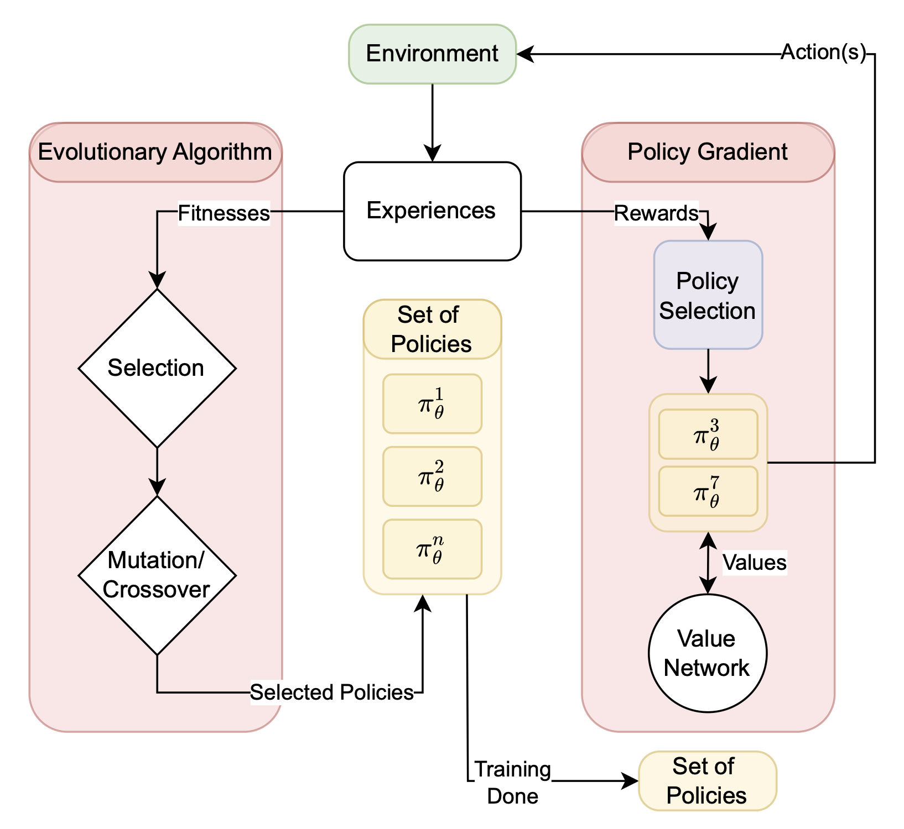
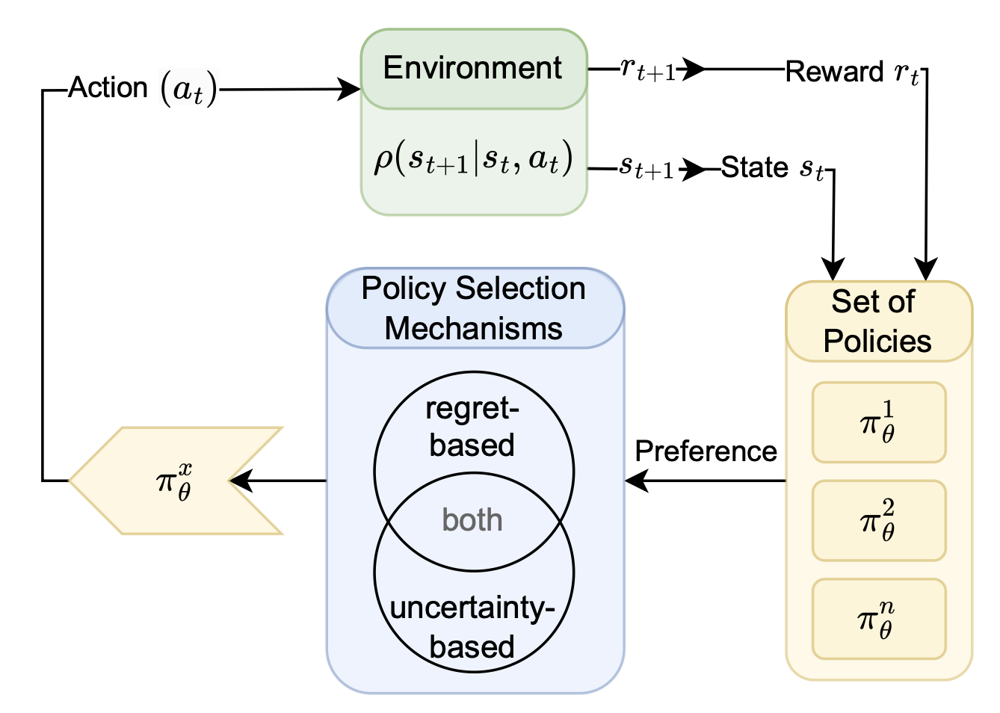
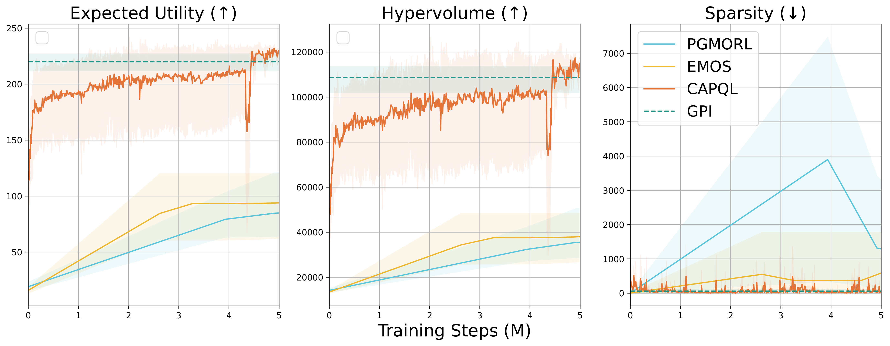
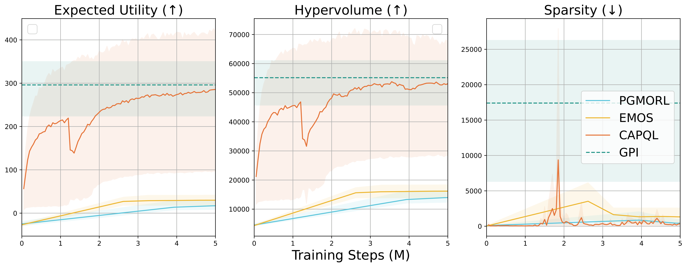
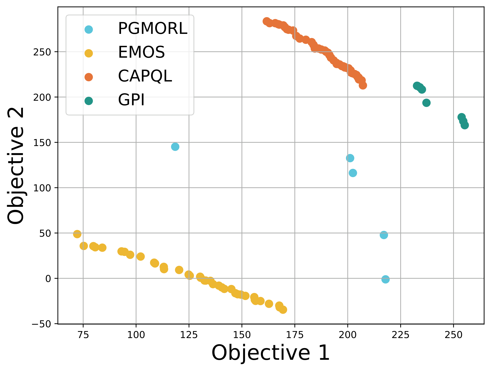
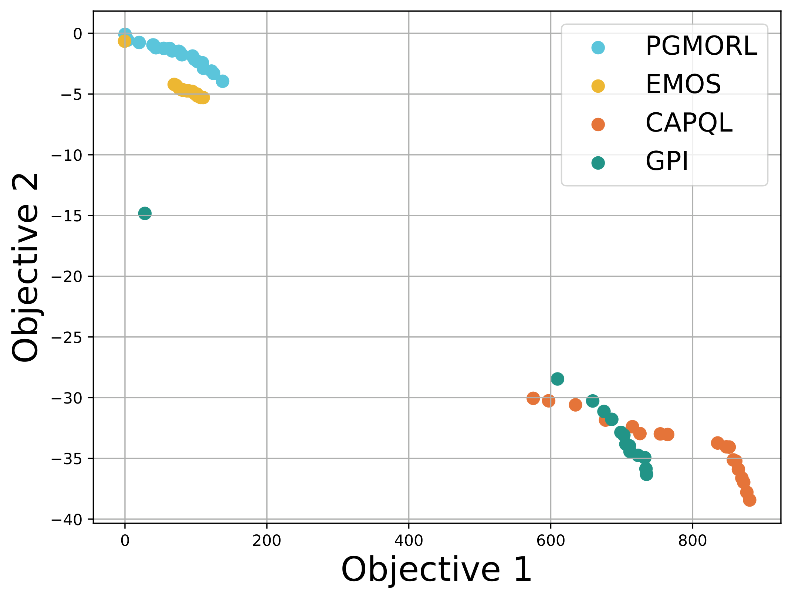

# Master Thesis: Multi-Objective Reinforcement Learning using Evolutionary Algorithms for Diverse Policy Selection (winter term 2024/2025)

This repository contains the code for my master's thesis, which overall explores the integration of Evolutionary Algorithms (EAs) and policy selection mechanisms into Multi-Objective Reinforcement Learning (MORL). The approach aims to improve diversity in policy populations, and therefore enabling more adaptive decision-making in dynamic environments with competing objectives. 

----- 
last updated: 02/12/2025

## Overview

Traditional MORL methods often struggle with maintaining a diverse set of solutions and typically produce a single policy selected based on predefined preferences. This repository implements **Evolutionary Multi-Objective Selector (EMOS)**, a hybrid approach that combines reinforcement learning with evolutionary techniques (mutation, selection, and crossover) to train a diverse set of policies along the Pareto front. Instead of committing to a fixed preference, a dynamic policy selection mechanism allows for adaptive decision-making at runtime.

## Contributions

- **complex evolutionary operators** including mutation, selection, and crossover applied to policies to evolve a population of diverse policies distributed along the Pareto front
- **approximating a Pareto front** while maintaining a diverse set of policies covering different trade-offs
- **dynamic policy selection**: selecting policies for gradient updates in real time based on current conditions
- multi-objective PPO for policy gradient updates 

### Methodology

|  |  |
|--|--|
|  |  |
| Figure 1a: EMOS's training framework. | Figure 1b: EMOS's policy selection mechanism at inference stage. |


## Structure 

```bash
masterthesis/
│
├── experiments/                    
│   ├── benchmark/
│   │   └── launch_experiment.py
│   └── hyperparameter_search/
│       ├── configs/   
│       └── launch_sweep.py                    
│
├── export-data/    
│   ├── XXX.csv	                 
│   └── export.ipynb
│
├── images/                
│
├── morl_baselines/             
│   ├── common/   
│   │   ├── model_based/  
│   │   ├── performance_indicators.py    
│   │   ├── experiments.py       
│   │   └── ...     
│   │
│   ├── multi_policy/   
│   │   ├── capql/     
│   │   ├── gpi_pd/       
│   │   ├── linear_support/    
│   │   ├── pgmorl/     
│   │   │   ├── pgmorl_EA.py
│   │   │   ├── pgmorl_selection.py
│   │   │   └── pgmorl.py
│   │   └── emos/    
│   │       ├── emos_complexEA_selection_dynamic.py
│   │       ├── emos_EA_selection_dynamic.py
│   │       └── emos_EA_selection.py
│   │
│   └── single_policy/             
│       └── ser/     
│           ├── mo_ppo_copy.py
│           ├── mo_ppo.py
│           ├── mo_q_learning.py
│           └── mosac_continous_action.py
│       
├── README.md    
├── test_pgmorl.py                              
└── .gitignore                             
```

## Getting Started

Follow the steps below to set up your environment and run experiments.

### Prerequisites

Ensure you have the following installed:

- Python 3.8+
- Virtual environment tools (`venv` or `conda`)
- Required dependencies 
	- mo-gymnasium (1.3.1)
	- gymnasium (1.0.0)
	- pymoo (0.6.1.2)
	- wandb (0.19.0)
	- morl-baselines (1.1.0)
	- morl_baselines
	- cvxpy (1.5.2)

### Installation

1. Clone the repository and navigate into the project directory:  
	```bash
	git clone https://github.com/your-username/masterthesis.git
	cd masterthesis
2. Running experiments:
   ```bash 
	python experiments/benchmark/launch_experiment.py \
    --algo emos_complexea_selection_dynamic \
    --env-id mo-hopper-2d-v4 \
    --num-timesteps 5000000 \
    --gamma 0.99 \
    --ref-point -100 -100 \
    --auto-tag True \
    --seed 6
3. Running hyperparameter sweeps:
   ```bash 
	python experiments/hyperparameter_search/launch_sweep.py \
    --algo emos_complexea_selection_dynamic \
    --env-id mo-hopper-2d-v4 \
    --ref-point -100 -100 \
    --config-name emos_complexea_selection_dynamic.yaml
## Results and Analysis
MORL is an effective framework for balancing multiple conflicting objectives, and EMOS aims to improve the efficiency of policy evolution in such contexts. While EMOS showed promise, it lagged behind methods like CAPQL and GPI in exploring broader regions of the objective space, though it outperformed PGMORL in terms of hypervolume and expected utility. 

### EMOS vs. SOFA algorithms

\
Figure 2a: Comparison of EMOS with SOFA algorithms in the *mo-hopper-2d-v4* environment.

\
Figure 2b: Comparison of EMOS with SOFA algorithms in the *mo-halfcheetah-v4* environment.

### Pareto fronts: EMOS vs. SOFA algorithms

|  |  |
|--|--|
|  |  |
| Figure 3a: Pareto fronts in *mo-hopper-2d-v4* domain. | Figure 3b: Pareto fronts in *mo-halfcheetah-v4* domain. |

Despite promising results, EMOS would benefit from more hyperparameter tuning and dynamic adjustments to novelty weight for better exploration-exploitation balance. Future work could focus on applying EMOS to more environments and enhancing scalability to address complex real-world multi-objective problems.
